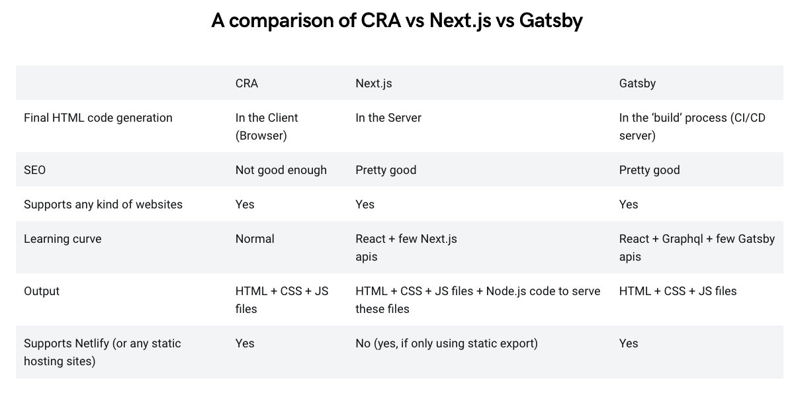

# Documentation

## 🏛 Project Structure

    📂 root
    ├── 📁 build
    ├── 📂 docs
    │  ├── 📁 images
    │  └── 📃 markdown files..
    ├── 📁 public
    ├── 📁 src
    │  ├── 📂 assets
    │  │  ├── 📁 icons
    │  │  └── 📁 images
    │  │  └── 📁 images
    │  ├── 📁 components
    │  ├── 📁 global
    │  │  └── 📁 hooks
    │  ├── 📁 pages
    │  │  ├── 📂 users
    │  │  │   └── 📃 [username].ts (dynamic route)
    │  │  └── 🏠 index.ts
    │  ├── 📁 styles
    │  └── 📁 tests
    ├── 📃 .gitignore
    ├── 📃 configs...
    ├── 📃 package.json
    └── 📃 README.md

## 🛠 Tools

### Next.js
The main reason why I choose Next.js is that unlike Gatsby, it's very good for dynamic content with the advantages of server-side rendering out of the box.
At first, I thought about starting with CRA(create-react-app), but I didn't want to [eject](https://medium.com/curated-by-versett/dont-eject-your-create-react-app-b123c5247741) 
the project or use another dependency(react-app-rewired) to configure Webpack.

Here a small comparison:

<https://coffeencoding.com/cra-vs-next-js-vs-gatsby/>

### Other Tools:
- TypeScript
- Prettier
- Eslint
- Stylelint
- Jest
- Styled components
- Conventional Commits 

## 💭 Thoughts

## 🔴 Gotchas

### Testing React Hooks
<https://github.com/testing-library/react-hooks-testing-library>

You can only call hooks from function components or other hooks.  

It can be quite difficult to wrap the Hook around a Component, so the Project uses the react-hooks-testing-library to do the hard work for us. 🎉


### Testing asynchronous React Hooks with react-hooks-testing-library

Get the utility `waitForNextUpdate()` from the renderHook function - example from the project:  
```
const {result, waitForNextUpdate()} = renderHook(() => useFetchUser('fools-mate'))`
```

Then we need to call `waitForNextUpdate()` before we can make our assertions.   
`await waitForNextUpdate();`

### Identical API responses between tests because SWR cache
<https://github.com/vercel/swr/pull/231#issuecomment-591614747>

If you use SWR in your Components or Hooks always remember to clear the cache of SWR before every test to prevent identical API responses.
```
import { cache } from 'swr';

afterEach(() => cache.clear());
```

To fix: `Warning: An update to TestHook inside a test was not wrapped in act(...).`  
Pass `{ dedupingInterval: 0 }` as option argument to your Hook:  
```
const { result } = renderHook(() => useFetchUser('fools-mate', { dedupingInterval: 0 }));
```
In Components use:
```
await act(async () => {
    <SWRConfig value={{ dedupingInterval: 0 }}>
      <Foo id="1" />
    </SWRConfig>
  });
```

### SWR hook
<https://swr.vercel.app/docs/conditional-fetching>
<https://swr.vercel.app/docs/options>

Don't forget to add conditions to hooks so SWR won't start a request at every render, or you will be temporarily blocked by the API in no time...
```
const { userData, isError, isLoading } = useFetchUser(
  debouncedSearchInput ? debouncedSearchInput : null
);
```

In development also pass this options to SWR to prevent API calls:
```
{
    revalidateOnFocus: false,
    revalidateOnReconnect: false,
    shouldRetryOnError: false,
}
```

### Prevent reload when linked to Dynamic Route
<https://nextjs.org/docs/routing/introduction>

If you are linking to a Dynamic Route, you must specify the prop "as" of the Next.js Link and set href to the \[slug\]:  
```<Link href="/blog/[slug]" as={`/blog/${post.slug}`}>```


## 🎉 Acknowledgements 
- ***Francesco Agnoletto*** for this great article about:  
[How to setup NextJS with TypeScript and ESLint + Prettier](https://decodenatura.com/how-to-set-up-nextjs-typescript-eslint-prettier/)
- ***Leigh Halliday*** that he made me aware of Mock Service Worker and offers a detailed tutorial about it:  
[Don't Mock Fetch (or Axios): Use Mock Service Worker and Test Like a User](https://www.youtube.com/watch?v=v77fjkKQTH0)  
